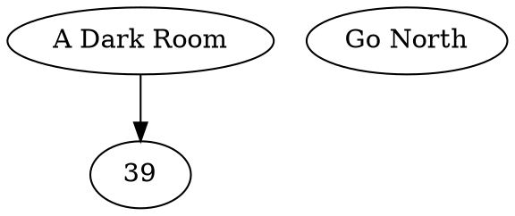

# An Analysis Attempt
From [furiousthinking](http://cian.furiousthinking.org/code/dark/) blog\
Forgive me redefining the wheel but Im just making sure everybody's on the same page

We know the Youtube game consists of videos with URLs (and their IDs) that point to other URLs. So the Dot results should eventually look like:


The raw XML holds the target URL IDs and probably the video's title. It is (somehow) converted to JSON like the sample below:
```json
{
  "hvkjP6dqpfY" : { "name" : "The Dark Room",
                    "link" : { "GO NORTH" : "X6PD4IUlCwo",
                               "TURN ON LIGHT SWITCH" : "-WG36-XrcU4",
                               "SLEEP" : "lsteokF2w8Q",
                               "WHY?" : "PPifzjxTahY" } },
```

JSON is made of pairs of keys and values separated by a colon, a value can be another nested object with more pairs. Note the whole file has a parent object (first curly bracket), then each 'video' object starting with the current URL ID as key, it contains two keys "name" and "link". The value of "name" is the video title, the value of "link" is another object with 4 items, the annotation's text label and then the annotation's URL IDs. (I could be wrong)\
This is then converted into Dot syntax. I don't understand Python but here's my attempt to analyse the script from the blog. \
First it imports a `json` module to use the methods and assigns the JSON object to an object variable "graph". \
It seems the `print` statement borrows syntax from C++. It groups references in parenthesis after the single `%` separated by commas, then before the `%` it has a string in single quotes with format specifiers `"%s"`. Their occurences correspond to the positions of the references and are substituted for them when printed.

```python
# A for-loop cycles through every 'video'. The method ".keys()" grabs the keys and assigns to the variable "key"
for key in graph.keys():

# 1st "%s" becomes "key" the first layer key which is the current video's ID
# 2nd "%s" becomes "graph[key]["name"]" referring to the value of the "name" key in the second layer which is the current video title
  print '"%s" [label="%s"]' % (key, graph[key]["name"])

# Now a nested for-loop which inherits the "key" variable for printing again.
# This time it targets the value of the "link" key in the second layer, which is an object, and grabs all values. It assigns each value to "link_key". And somehow assigns each key to "label"
  for label, link_key in graph[key]["link"].items():

# 1st "%s" becomes "key" again which is the current video's ID
# 2nd "%s" becomes "link_key" which is the annotation's ID, the value
# 3rd "%s" becomes "label" which is the annotation's text, the key
    print '"%s" -> "%s" [label="%s"]' % (key, link_key, label)
# I think the var "link_key" shouldve been called "link_value" since it becomes the json value
```
